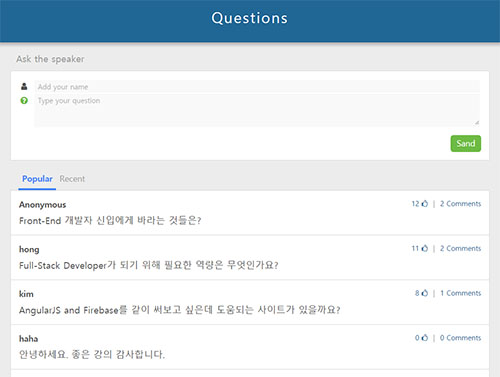

******************************************************
# TIL
Today I Learned~!! 열공모드~*
******************************************************

## [Hong's portfolio - sli.do 서비스 개발중](https://sharryhong.github.io/TIL/angularjs/hs_slido/src/index.html)

#### 프로젝트 주제 

- 강의 중 실시간으로 질문, 답변을 받는 서비스인 sli.do 사이트 + 적절한 기능 보완  
- 실제 서비스 예) [sli.do](https://app.sli.do/event/qao1egje/ask)

#### Front-End 개발 기술

- AngularJS, JSON, JavaScript
- HTML, SASS to CSS 
- Gulp

#### 프로젝트 고려사항

- 적절한 기능 추가 
답변(comment) 기능 추가

- 반응형 웹  
미디어쿼리 기술을 사용하여 다양한 기기에서 적합하게 보이도록 하였습니다.

- 추후 추가 예정  
하이브리드 웹앱 : 개발 후 아이오닉 기술을 사용하여 모바일 앱으로도 구현할 예정입니다. 
firebase나 back-end 기술을 사용하여 실제 데이터를 사용하고 싶습니다. 

******************************************************

## AngularJS

### 1. First-app : This Month's Bestsellers App
- [코드카데미](https://www.codecademy.com) Lesson 1. Your First App 공부 후 github에 정리하기
- [결과물 바로가기](https://sharryhong.github.io/TIL/angularjs/01_first_app)
- [설명 보기](https://github.com/sharryhong/TIL/tree/master/angularjs/01_first_app)

### 2. Directives : App Market App
- 코드카데미 Lesson 2. Directives 공부 후 github에 정리하기
- [결과물 바로가기](https://sharryhong.github.io/TIL/angularjs/02_directives)
- [설명 보기](https://github.com/sharryhong/TIL/tree/master/angularjs/02_directives)

### 3. Services : Weather forecast App
- 코드카데미 Lesson 3. Services 공부 후 github에 정리하기
- [결과물 바로가기](https://sharryhong.github.io/TIL/angularjs/03_services)
- [설명 보기](https://github.com/sharryhong/TIL/tree/master/angularjs/03_services)

### 4. Routing : Gallery app
- 코드카데미 Lesson 4. Routing 공부 후 github에 정리하기
- [결과물 바로가기](https://sharryhong.github.io/TIL/angularjs/04_routing)
- [설명 보기](https://github.com/sharryhong/TIL/tree/master/angularjs/04_routing)